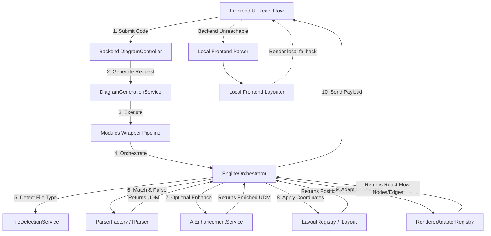
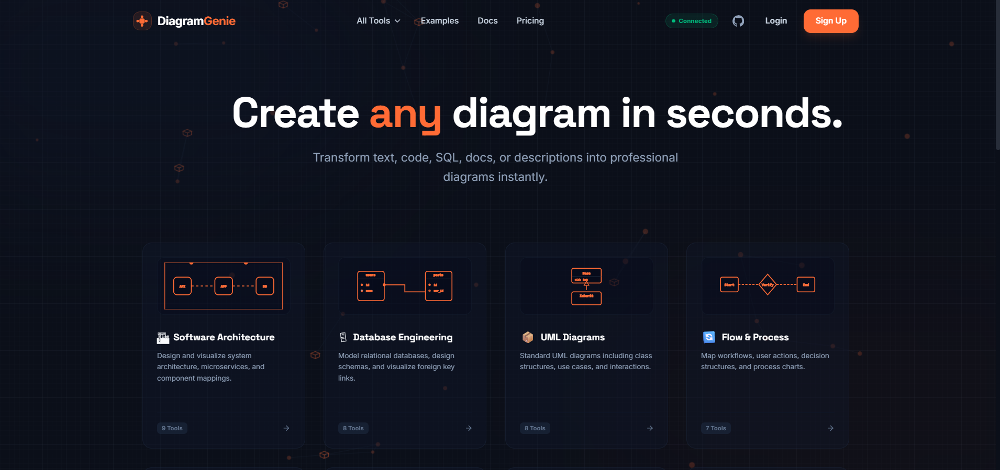

# Diagram Genie

A professional diagramming platform that converts source code, configurations, schemas, and outlines into a normalized Universal Diagram Model (UDM) and renders them as beautiful interactive visual graphs.

## Overview

### The Problem
System architecture, database schemas, and workflows are frequently documented using manual diagramming tools. This manual process is slow, prone to design inconsistency, and quickly drifts from the actual source code implementation.

### The Solution
**Diagram Genie** solves this problem by offering a **code-to-diagram pipeline**. It parses code directly into a standardized JSON representation called the **Universal Diagram Model (UDM)**, lays out the components programmatically, and renders them interactively. 

The system operates deterministically using rule-based lexer/parsers, with a pluggable AI enhancement layer that can enrich nodes and relationships when API keys are available, and a frontend local parser/layouter that serves as an offline fallback when the backend is unreachable.

---

## Supported Diagram Types

The following table lists the diagram types supported by the platform, showing their sourceType alias, implementation details, and maturity level:

| Diagram Type | sourceType | Input Syntax | Parser | Layout Strategy | Export | Status |
| :--- | :--- | :--- | :--- | :--- | :--- | :--- |
| **System Architecture** | `architecture` / `system` / `plain_text` | Custom text with arrow `->` links | `ArchitectureParser` | Layered Grid or Semantic Tiers | SVG, PNG | **Implemented** |
| **Database & ER** | `sql` / `database` / `er` | SQL DDL (`CREATE TABLE`, `REFERENCES`) | `SqlParser` | Grid (Entity tables) | SVG, PNG | **Implemented** (Canonical column schemas) |
| **UML Class** | `class` / `uml` | UML notation (Class definitions & links) | `ArchitectureParser` | Grid / Hierarchical | SVG, PNG | **Implemented** (Basic connections) |
| **Flowchart** | `flow` / `flowchart` | Linear flowcharts and step definitions | `FlowchartParser` | Hierarchical Dag / Tree | SVG, PNG | **Implemented** |
| **UML Sequence** | `sequence` / `uml-sequence` | Message exchanges e.g., `Alice -> Bob` | `UmlSequenceParser` | Top-down timeline grid | SVG, PNG | **Implemented** |
| **Cloud Architecture** | `cloud` / `infra` | Cloud containment syntax | `CloudDslParser` | Nested grouping / parentId | SVG, PNG | **Implemented** (containment links) |
| **Docker Compose** | `docker-compose` | YAML format (services/dependencies) | `DockerComposeParser` | Layered network tree | SVG, PNG | **Implemented** |
| **API Visualizer** | `openapi` | JSON OpenAPI specification | `OpenApiParser` | Hierarchical routing tree | SVG, PNG | **Implemented** |
| **AI/ML Pipeline** | `pipeline` / `pipeline-dsl` | Processing nodes linked by `->` | `PipelineDslParser` | Sequential flow layout | SVG, PNG | **Implemented** |
| **Prisma Relation** | `prisma` | Prisma Schema model definitions | `PrismaParser` | Relational network layout | SVG, PNG | **Implemented** |
| **Mindmap** | `mindmap` | Indented Markdown bullet lists | `MarkdownParser` | Radial (Root radiates out) | SVG, PNG | **Implemented** (Recently stabilized) |

---

## Architecture Overview

Diagram Genie uses a decoupled frontend-backend architecture. Below is a high-level view of the execution flow:



---

## Technology Stack

### Frontend
- **Framework**: React 19, TypeScript, Vite 8
- **Rendering**: `@xyflow/react` (React Flow 12) for rendering the diagram canvas
- **Editor**: `@monaco-editor/react` for the code input terminal
- **State Management**: Zustand 5
- **Styling**: Vanilla CSS with TailwindCSS 4
- **Animation**: Framer Motion 12

### Backend
- **Framework**: NestJS 11, TypeScript
- **Configuration & Validation**: NestJS Config, Zod
- **Logging & Metrics**: `nestjs-pino`, `pino`
- **Documentation**: Swagger UI (`@nestjs/swagger`)

### AI Enhancement
- **Providers**: Google Gemini, OpenAI, Anthropic, Groq, Ollama
- **Model Client SDKs**: `@google/generative-ai`, `openai`, `@anthropic-ai/sdk`, `groq-sdk`

### Testing
- **Framework**: Jest 30, `supertest` for NestJS e2e testing

---

## Quick Start

### Prerequisites
- Node.js version 18 or higher (v20+ recommended)
- npm version 9 or higher

### 1. Clone and Install Dependencies
```bash
# Clone the repository
git clone <repository_url>
cd Diagram_Genie

# Install backend dependencies
cd backend
npm install

# Install frontend dependencies
cd ../frontend
npm install
```

### 2. Configure Environment Variables
Create a `.env` file in the `backend/` directory:
```env
PORT=3000
API_PREFIX=api

# AI Credentials (Optional - Falls back to deterministic rule-based parsing if missing)
AI_ENABLED=true
AI_DEFAULT_PROVIDER=gemini
AI_GEMINI_API_KEY=your_gemini_api_key_here
AI_OPENAI_API_KEY=your_openai_api_key_here
```

Create a `.env` file in the `frontend/` directory:
```env
VITE_API_URL=http://localhost:3000/api/v1
```

### 3. Running the Application
```bash
# Start Backend (from backend/ directory)
npm run start:dev

# Start Frontend (from frontend/ directory in a separate terminal)
npm run dev
```
Open your browser and navigate to `http://localhost:5173`.

---

## Testing & Build

```bash
# Run backend tests
cd backend
npm test

# Run backend build compilation
npm run build

# Run frontend build compilation
cd ../frontend
npm run build
```

---

## Screens / Output

Here is a preview screenshot of the DiagramGenie interactive workspace:



---

## Documentation Index

Explore the comprehensive developer guides and system documentation in the `docs/` folder:

- **Core Engine & Design**:
  - [Architecture Deep Dive](docs/architecture.md) — Production routing paths, file detectors, and stage configurations.
  - [Universal Diagram Model (UDM)](docs/udm.md) — Internal JSON node and edge schema specs.
  - [Deterministic Parsers](docs/parsers.md) — Abstract parsing workflows and column/FK mapping logic.
  - [Layout Engine](docs/layout-engine.md) — Available active layout positioning algorithms.
  - [Renderer Adapters & Shapes](docs/rendering.md) — Custom React Flow nodes, edge lines, and UML relationship markers.
- **Frontend & APIs**:
  - [Frontend Guide](docs/frontend.md) — State management, Monaco editor, and local fallback parser.
  - [API Endpoints Reference](docs/api.md) — Payload requests, responses, and validation DTOs.
  - [AI Enhancement Layer](docs/ai.md) — Observability schemas and LLM providers configuration.
  - [Export System](docs/export.md) — Exporter bounds calculations and SVG/PNG output generators.
- **Support & Contribution**:
  - [Getting Started & Configuration](docs/getting-started.md) — Installation and environmental configs.
  - [Diagram Types Index](docs/diagram-types.md) — Supported parser formats list.
  - [Testing Suite](docs/testing.md) — Automated tests and coverage gaps.
  - [Troubleshooting Manual](docs/troubleshooting.md) — Solutions for common development/setup issues.
  - [Contribution Guidelines](docs/contributing.md) — How to add new diagram types, parsers, and layouts.
  - [Roadmap](docs/roadmap.md) — Project milestones and improvements.
  - [System Limitations](docs/limitations.md) — Documented tech debt and engineering constraints.
