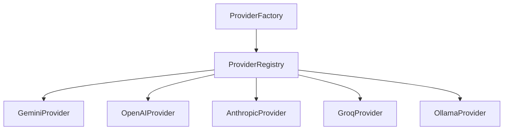

# AI Enhancement Layer

Diagram Genie features an AI pipeline that runs alongside the deterministic parsers. It can enrich graph nodes, discover extra relations, and output descriptive metadata.

---

## 1. Deterministic Parsing vs. AI Enhancement

It is important to highlight that **AI is not required** to generate diagrams:

- **Base Deterministic Parser**: Runs locally on the server or client. It tokenizes the input code and structures nodes and connections. This process is fast, deterministic, and always succeeds.
- **AI Enhancement Layer**: If `AI_ENABLED=true` and valid API keys are configured, the parser output is sent to [`AiEnhancementService`](file:///C:/Users/jhata/.gemini/antigravity/scratch/Diagram_Genie/backend/src/modules/diagram/ai-enhancement.service.ts). The service prompts an LLM to enrich the diagram (e.g. adding database schema types or server tags). The enriched diagram is then merged back into the UDM.
- **AI Fallback Safe Safeguard**: If the AI request times out, fails schema validation, or throws an API credential exception, the system catches the error, logs a warning, and **falls back immediately** to the deterministic rule-based parsed diagram. The user request completes successfully.

---

## 2. Configured Providers

AI models are resolved using a Strategy Pattern via the `ProviderFactory` and `ProviderRegistry`. 



The following table lists the providers defined in [`core/ai/providers`](file:///C:/Users/jhata/.gemini/antigravity/scratch/Diagram_Genie/backend/src/core/ai/providers):

| Provider Name | Strategy Class | Default Model | Configuration Key | Notes |
| :--- | :--- | :--- | :--- | :--- |
| **Gemini** | `GeminiProvider` | `gemini-2.5-flash` | `AI_GEMINI_API_KEY` | Primary default provider |
| **OpenAI** | `OpenAIProvider` | `gpt-4o-mini` | `AI_OPENAI_API_KEY` | Supports JSON response formats |
| **Anthropic** | `AnthropicProvider` | `claude-3-5-sonnet` | `AI_ANTHROPIC_API_KEY` | - |
| **Groq** | `GroqProvider` | `llama-3.3-70b-versatile` | `AI_GROQ_API_KEY` | Optimized for low-latency calls |
| **Ollama** | `OllamaProvider` | `llama3` | `AI_OLLAMA_ENDPOINT` | Local offline provider strategy |

---

## 3. Execution Pipeline Workflow

The AI execution workflow is controlled by the [`AIManager`](file:///C:/Users/jhata/.gemini/antigravity/scratch/Diagram_Genie/backend/src/core/ai/services/ai-manager.ts):

### Prompt Compilation
The `PromptBuilder` combines prompt templates (from [`core/ai/prompts`](file:///C:/Users/jhata/.gemini/antigravity/scratch/Diagram_Genie/backend/src/core/ai/prompts)) with user code placeholders, instructing the LLM to output structured JSON conforming to the diagram schema.

### Retry & Correction Loop
If a model returns a malformed response that fails Zod schema verification:
1. The `AIManager` catches the error and starts a second attempt.
2. It sends the malformed JSON and error details back to the LLM, prompting for correction.
3. If both attempts fail validation, the manager throws an `AIValidationException` and the system falls back to the deterministic diagram.

### Response Repairs
To handle common formatting errors, the manager runs utility scripts to:
- Strip markdown backticks (` ```json ... ``` `).
- Strip trailing commas in objects and arrays.
- Close unclosed quotes, brackets, or braces.

### Observability Metrics
Every transaction log is captured by the [`AiObservabilityService`](file:///C:/Users/jhata/.gemini/antigravity/scratch/Diagram_Genie/backend/src/core/ai/observability/ai-observability.service.ts), tracking:
- API latency histograms.
- Token consumption (input/output tokens).
- Provider and model usage counts.
- Retries and fallback occurrences.

---

## Related Documentation
- [REST API Endpoints Reference](api.md) — Metrics endpoint responses.
- [System Architecture](architecture.md) — Live generation sequencing.
- [Deterministic Parsers](parsers.md) — Raw UDM formats.
