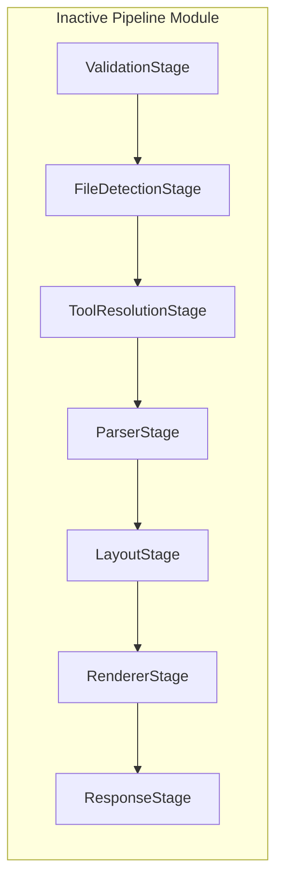

# Architecture Deep Dive

This document details the architectural design of Diagram Genie. It provides a trace of how code text submitted by the frontend is parsed, enhanced, positioned, and serialized into visual rendering data.

---

## High-Level Component Structure

Diagram Genie consists of two primary applications:
1. **Frontend**: A React/Vite/TypeScript single-page application that renders interactive diagram canvases using `@xyflow/react` and provides code editing via Monaco.
2. **Backend**: A NestJS microservice that runs the diagram parser engine, AI orchestration, layout positioning algorithms, and translates diagrams into target layouts.

---

## 1. Live Production Path

When a user triggers diagram generation on the frontend UI, the request flows through the backend via the following synchronous execution path:

```mermaid
sequenceDiagram
    autonumber
    actor User
    participant UI as React UI (React Flow)
    participant Ctrl as DiagramController
    participant DGS as DiagramGenerationService
    participant GP as GenerationPipeline (Modules)
    participant EO as EngineOrchestrator
    participant FDS as FileDetectionService
    participant Parser as IParser (Sql/Arch/etc.)
    participant AI as AiEnhancementService
    participant Layout as ILayout (Grid/Radial/etc.)
    participant Registry as RendererAdapterRegistry

    User->>UI: Inputs code and clicks Generate
    UI->>Ctrl: POST /api/v1/diagrams/generate
    Ctrl->>DGS: generate(GenerateDiagramDto)
    DGS->>GP: execute(GenerateDiagramDto)
    GP->>EO: orchestrate(...)
    
    rect rgb(15, 23, 42)
        Note over EO, Registry: Engine Orchestrator Pipeline
        EO->>FDS: detect(filename, mimeType, source)
        FDS-->>EO: Returns auto-resolved sourceType
        EO->>Parser: parse(source, options)
        Parser-->>EO: Returns base ParserResult (Raw UDM)
        EO->>AI: enhance(diagram, source, sourceType, options)
        AI-->>EO: Returns enriched UDM Diagram
        EO->>Layout: layout(diagram, options)
        Layout-->>EO: Returns positioned UDM Diagram
        EO->>Registry: getAdapter('react-flow')
        Registry-->>EO: Returns ReactFlowAdapter
        EO->>Registry: get all other active adapters
        Registry-->>EO: Returns adapted export payloads (Mermaid, Cytoscape)
    end

    EO-->>GP: Returns OrchestratorResult
    GP-->>DGS: Returns OrchestratorResult
    DGS-->>Ctrl: Returns OrchestratorResult
    Ctrl-->>UI: Response (JSON with nodes/edges & exports)
    UI-->>User: Renders Canvas & Populates Exporters
```

### Trace Details
1. **Controller Layer**: [`DiagramController`](file:///C:/Users/jhata/.gemini/antigravity/scratch/Diagram_Genie/backend/src/modules/diagram/diagram.controller.ts) receives the JSON payload, validated via a global `ZodValidationPipe`.
2. **Generation Service**: [`DiagramGenerationService`](file:///C:/Users/jhata/.gemini/antigravity/scratch/Diagram_Genie/backend/src/modules/diagram/diagram-generation.service.ts) coordinates the call.
3. **Module Pipeline Wrapper**: [`GenerationPipeline`](file:///C:/Users/jhata/.gemini/antigravity/scratch/Diagram_Genie/backend/src/modules/diagram/generation-pipeline.ts) logs the invocation and forwards it.
4. **Engine Orchestrator**: [`EngineOrchestrator`](file:///C:/Users/jhata/.gemini/antigravity/scratch/Diagram_Genie/backend/src/modules/diagram/engine-orchestrator.ts) controls the core sequence.
5. **File Type Detection**: [`FileDetectionService`](file:///C:/Users/jhata/.gemini/antigravity/scratch/Diagram_Genie/backend/src/core/diagram-engine/file-detector/file-detection.service.ts) runs a list of registered regex rules to determine if the input is SQL, YAML, JSON, or Markdown when `sourceType` is omitted.
6. **Parser Execution**: [`ParserFactory`](file:///C:/Users/jhata/.gemini/antigravity/scratch/Diagram_Genie/backend/src/core/diagram-engine/factory/parser.factory.ts) resolves the matched parser plugin (e.g. `SqlParser`, `MarkdownParser`). The parser validates the text syntax and tokenizes the code stream, producing a raw, coordinate-free Universal Diagram Model (UDM) diagram.
7. **AI Enrichment**: [`AiEnhancementService`](file:///C:/Users/jhata/.gemini/antigravity/scratch/Diagram_Genie/backend/src/modules/diagram/ai-enhancement.service.ts) sends the raw diagram and code snippet to the LLM backend (if configured) to infer attributes, add descriptive properties, or identify extra relationships. It merges results back into the UDM.
8. **Layout Algorithm**: The [`LayoutRegistry`](file:///C:/Users/jhata/.gemini/antigravity/scratch/Diagram_Genie/backend/src/core/diagram-engine/layout/registry/layout.registry.ts) fetches the requested positioning plugin (defaults to `grid` or `radial` for mindmaps) to compute node coordinate assignments.
9. **UI Adapters & Serialization**: The [`RendererAdapterRegistry`](file:///C:/Users/jhata/.gemini/antigravity/scratch/Diagram_Genie/backend/src/modules/diagram/registry/renderer-adapter.registry.ts) matches target adapters:
   - `ReactFlowAdapter` maps the UDM into `@xyflow/react` nodes and edges.
   - `MermaidAdapter` and `CytoscapeAdapter` translate the UDM into secondary representations returned in the `exportedFormats` object.

---

## 2. Inactive / Orphaned Stage-Based Pipeline

The codebase contains an alternative, stage-based generation pipeline architecture located in the `core/diagram-engine` directory. 

> [!WARNING]
> This stage-based architecture is **inactive** and does **not** process live production requests.

The stage-based pipeline is structured as follows:

### Components of the Inactive Pipeline:
- **`GenerationPipeline`** ([`core/diagram-engine/pipeline/generation-pipeline.ts`](file:///C:/Users/jhata/.gemini/antigravity/scratch/Diagram_Genie/backend/src/core/diagram-engine/pipeline/generation-pipeline.ts)): A workflow manager that registers sequential stages, sorts them based on priority order integers, and executes them with a shared `GenerationContext`.
- **Pipeline Stages**:
  - `ValidationStage` (order `0`) — Validates request variables.
  - `FileDetectionStage` (order `10`) — Resolves types from filenames.
  - `ToolResolutionStage` (order `20`) — Evaluates needed dependencies.
  - `ParserStage` (order `30`) — Executes rule-based parsers.
  - `LayoutStage` (order `40`) — Applies layout positions.
  - `RendererStage` (order `50`) — Adapts UDM diagrams to renderers.
  - `ResponseStage` (order `100`) — Formats final JSON payload.

### Why is it Inactive?
- NestJS registers this pipeline and its stages in [`DiagramEngineModule`](file:///C:/Users/jhata/.gemini/antigravity/scratch/Diagram_Genie/backend/src/core/diagram-engine/diagram-engine.module.ts) and exports `GenerationPipeline`.
- However, `DiagramGenerationService` (which handles the live controllers) imports a different, local class named `GenerationPipeline` from `./generation-pipeline` which immediately calls `EngineOrchestrator.orchestrate`.
- The `EngineOrchestrator` runs its own direct hardcoded orchestration steps, completely bypassing the stage pipeline list.

---

## 3. Renderer Adapter System

To support multiple output formats, the system uses a pluggable adapter registration system.

- **`RendererAdapterRegistry`** ([`modules/diagram/registry/renderer-adapter.registry.ts`](file:///C:/Users/jhata/.gemini/antigravity/scratch/Diagram_Genie/backend/src/modules/diagram/registry/renderer-adapter.registry.ts)): A registry that stores classes implementing the `IRendererAdapter` contract.
- **Implemented Adapters**:
  - `ReactFlowAdapter` ([`modules/diagram/adapters/react-flow.adapter.ts`](file:///C:/Users/jhata/.gemini/antigravity/scratch/Diagram_Genie/backend/src/modules/diagram/adapters/react-flow.adapter.ts)): Outputs coordinates and custom node styles for frontend rendering.
  - `MermaidAdapter` ([`modules/diagram/adapters/mermaid.adapter.ts`](file:///C:/Users/jhata/.gemini/antigravity/scratch/Diagram_Genie/backend/src/modules/diagram/adapters/mermaid.adapter.ts)): Serializes UDM graphs into Mermaid DSL string representations (e.g. `graph TD ...`).
  - `CytoscapeAdapter` ([`modules/diagram/adapters/cytoscape.adapter.ts`](file:///C:/Users/jhata/.gemini/antigravity/scratch/Diagram_Genie/backend/src/modules/diagram/adapters/cytoscape.adapter.ts)): Adapts diagrams into Cytoscape JSON element formats.

---

## Related Documentation
- [Deterministic Parsers](parsers.md) — How code text is converted to UDM.
- [Layout Engine](layout-engine.md) — How UDM coordinates are assigned.
- [Universal Diagram Model](udm.md) — Detailed fields structure.
- [API Endpoints Reference](api.md) — Request and response contracts.
