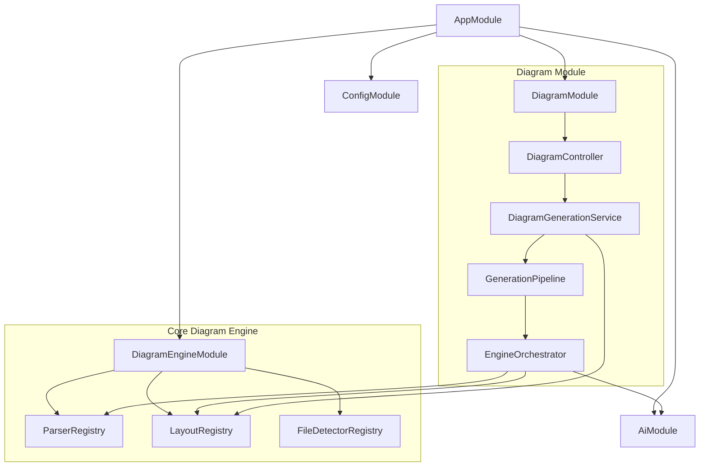

# Backend Architecture Guide

This document details the backend application built using NestJS. It outlines the modular organization, dependency injections, configuration schemas, and error filters.

---

## 1. Modular Organization & Dependency Relationships

The backend codebase is divided into two primary sub-folders:
- **`core/`**: Shared infrastructure logic (AI providers, configurations, logging, core parser types).
- **`modules/`**: HTTP controllers, request-handling services, and orchestrators.

Below is the dependency injection map:



---

## 2. Component deep dives

### HTTP Controllers ([`modules/diagram/diagram.controller.ts`](file:///C:/Users/jhata/.gemini/antigravity/scratch/Diagram_Genie/backend/src/modules/diagram/diagram.controller.ts))
Declares endpoints under the `/diagrams` controller route. It integrates Swagger attributes for interactive API documentation and enforces schema checking using the custom `ZodValidationPipe`.

### Diagram Generation Service ([`modules/diagram/diagram-generation.service.ts`](file:///C:/Users/jhata/.gemini/antigravity/scratch/Diagram_Genie/backend/src/modules/diagram/diagram-generation.service.ts))
Injects the local `GenerationPipeline`, layout registries, and renderer registries. It coordinates pipeline execution, provides static tool catalog list checkers, and returns real-time AI metrics.

### Engine Orchestrator ([`modules/diagram/engine-orchestrator.ts`](file:///C:/Users/jhata/.gemini/antigravity/scratch/Diagram_Genie/backend/src/modules/diagram/engine-orchestrator.ts))
Coordinates the diagram generation steps:
1. Auto-detects input sourceType if omitted.
2. Resolves and runs the matched parser strategy (e.g. `SqlParser` or `MarkdownParser`).
3. Sends raw parsed UDM node maps to `AiEnhancementService`.
4. Coordinates node positions via layout algorithms (defaulting to grid or radial layouts).
5. Adapts coordinates to React Flow format, and populates export payloads (e.g. Mermaid representation).

### AI Enhancer ([`modules/diagram/ai-enhancement.service.ts`](file:///C:/Users/jhata/.gemini/antigravity/scratch/Diagram_Genie/backend/src/modules/diagram/ai-enhancement.service.ts))
Checks if AI is active via the `AIManager`. If active, it forwards the code input to the AI pipeline to enrich node details (e.g. identifying server tiers or additional ports). If AI is disabled or fails, it returns the base parser output.

---

## 3. Configuration & Environmental Schema

NestJS uses `@nestjs/config` to validate environment variables.
- Config schema validation is defined using Zod rules inside [`backend/src/core/config/config.validation.ts`](file:///C:/Users/jhata/.gemini/antigravity/scratch/Diagram_Genie/backend/src/core/config/config.validation.ts).
- Variables include server `PORT`, `API_PREFIX` (defaults to `'api'`), `AI_ENABLED` flags, default model providers, and API keys.

---

## 4. Error Handling & Filter Pipes

- **Request Validation**: [`ZodValidationPipe`](file:///C:/Users/jhata/.gemini/antigravity/scratch/Diagram_Genie/backend/src/common/pipes/zod-validation.pipe.ts) intercepts requests. If body schemas fail Zod checks, it throws a `BadRequestException` containing details of the validation errors.
- **Global Exception Filter**: [`HttpExceptionFilter`](file:///C:/Users/jhata/.gemini/antigravity/scratch/Diagram_Genie/backend/src/common/filters/http-exception.filter.ts) catches all HTTP exceptions. It formats uniform error response bodies:
  ```json
  {
    "statusCode": 400,
    "message": "Syntax validation failed for parser: sql-parser",
    "timestamp": "2026-08-16T16:30:00.000Z",
    "path": "/api/v1/diagrams/generate"
  }
  ```
  It logs detailed stack traces to Pino logger, while returning safe, sanitised messages to the client.

---

## Related Documentation
- [Architecture Deep Dive](architecture.md) — Routing trace details.
- [REST API Endpoints Reference](api.md) — Endpoint specifications.
- [AI Enhancement Layer](ai.md) — Models and observability details.
