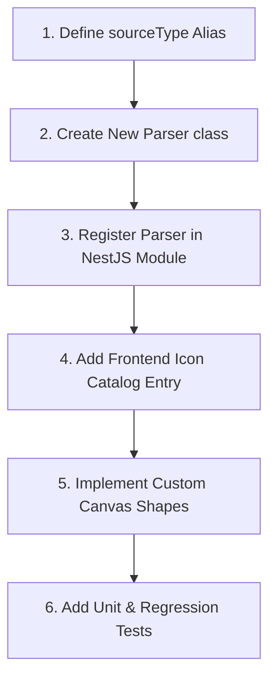

# Contribution Guidelines

This guide details how to extend Diagram Genie by adding new parsers, diagram types, layout algorithms, or renderer adapters.

---

## 1. Development Guidelines

- **Clean Commits**: Submit pull requests against the main branch. Ensure your working directory is clean.
- **Code Standards**:
  - Keep logic modular. Concrete parsers should focus on syntax parsing and delegate layout to layouters.
  - Follow the NestJS dependency injection guidelines. Register new services in their respective modules.
  - Always run tests and verify compiles before submitting PRs.
- **No Secrets**: Never commit private keys, endpoints, or credentials. Use placeholder variables.

---

## 2. How to Add a New Diagram Type

To add support for a new diagram type (e.g. "State Diagram"), follow this workflow:



### Step 1: Define sourceType Alias
Identify a unique sourceType string (e.g. `'state-diagram'`).

### Step 2: Create a Parser Plugin
Create a new file in `backend/src/core/diagram-engine/parsers/`. Implement the `IParser` interface:
```typescript
import { Injectable } from '@nestjs/common';
import { IParser } from '../interfaces/parser.interface';
import { ParserRegistry } from '../registry/parser.registry';
import { ParserResult } from './parser-result.interface';

@Injectable()
export class StateDiagramParser implements IParser {
  readonly id = 'state-diagram-parser';

  constructor(private readonly registry: ParserRegistry) {
    this.registry.register(this);
  }

  supports(sourceType: string): boolean {
    return sourceType.toLowerCase() === 'state-diagram';
  }

  validate(source: string): boolean {
    return source.trim().length > 0;
  }

  async parse(source: string): Promise<ParserResult> {
    // Parse tokens and build Diagram nodes/edges
  }
}
```

### Step 3: Register the Parser
Register your new parser in the `providers` list of [`backend/src/core/diagram-engine/diagram-engine.module.ts`](file:///C:/Users/jhata/.gemini/antigravity/scratch/Diagram_Genie/backend/src/core/diagram-engine/diagram-engine.module.ts).

### Step 4: Add Frontend Catalog Entry
Update the catalog list in [`backend/src/modules/diagram/config/catalog.ts`](file:///C:/Users/jhata/.gemini/antigravity/scratch/Diagram_Genie/backend/src/modules/diagram/config/catalog.ts) and the frontend previews inside [`frontend/src/components/diagram/CategoryPreviews.tsx`](file:///C:/Users/jhata/.gemini/antigravity/scratch/Diagram_Genie/frontend/src/components/diagram/CategoryPreviews.tsx).

### Step 5: Implement Canvas Shapes
If the diagram requires custom shapes, register them in `nodeTypes` in [`frontend/src/components/diagram/CustomNodes.tsx`](file:///C:/Users/jhata/.gemini/antigravity/scratch/Diagram_Genie/frontend/src/components/diagram/CustomNodes.tsx).

### Step 6: Write Tests
Add unit tests verifying your parser's behavior inside [`backend/src/core/diagram-engine/tests/parsers.spec.ts`](file:///C:/Users/jhata/.gemini/antigravity/scratch/Diagram_Genie/backend/src/core/diagram-engine/tests/parsers.spec.ts). Run `npm test` to verify.

---

## 3. How to Add a Layout Strategy

1. Create a layout class implementing `ILayout` inside `core/diagram-engine/layout/algorithms/`.
2. Implement your positioning logic inside the `layout()` method to assign `position: { x, y }` coordinates to nodes.
3. Register the layout provider in [`diagram-engine.module.ts`](file:///C:/Users/jhata/.gemini/antigravity/scratch/Diagram_Genie/backend/src/core/diagram-engine/diagram-engine.module.ts).

---

## 4. How to Add a Renderer Adapter

1. Create a class implementing the `IRendererAdapter` interface in `modules/diagram/adapters/`.
2. Define the target format output (e.g. D3 layout or image structures) and implement the translation logic in `adapt()`.
3. Register the class in the `RendererAdapterRegistry` inside `modules/diagram/diagram.module.ts`.

---

## Related Documentation
- [Deterministic Parsers](parsers.md) — Parser definitions.
- [Layout Engine Guides](layout-engine.md) — Positioning registries.
- [Testing Suite](testing.md) — How to run validation tests.
