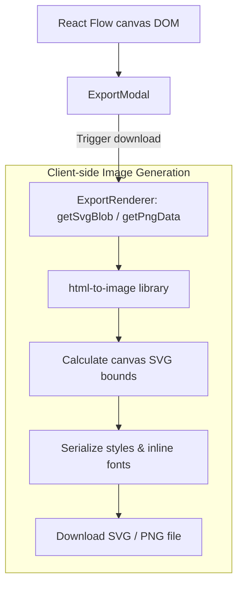

# Export System

Diagram Genie provides options to export interactive diagrams as static SVG vector images or PNG raster binaries. This document explains the export architecture, serialization pipelines, and current verification gaps.

---

## 1. Export Architecture

Export generation is handled primarily on the client-side using serialized snapshots of the active React Flow canvas:

---

## 2. Exporter Implementation Details

### Bounds Calculation
- To prevent exporting empty workspace space, the exporter scans all nodes on the canvas using [`ExportSerializer.ts`](file:///C:/Users/jhata/.gemini/antigravity/scratch/Diagram_Genie/frontend/src/utils/export/ExportSerializer.ts) to find the minimum/maximum coordinates.
- It computes the overall bounding box width and height, applying a constant boundary padding.
- The viewBox attribute of the exported SVG is adjusted to frame the active nodes tightly.

### Theme & Style Inline Serialization
- Static images do not run external stylesheet links. Thus, the exporter must extract stylesheet values (e.g. Tailwind colors, custom font files) and inject them inline inside `<style>` blocks inside the SVG element before exporting.
- It sets node text variables using system font stack fallbacks (`ui-monospace`, `SFMono-Regular`, `Consolas`, `monospace`) to guarantee readable typefaces on target devices.

### Image Generators
- **SVG Generation**: Serializes the raw inline elements, converts them into a text blob with MIME type `image/svg+xml`, and streams it to a downloadable file.
- **PNG Generation**: Invokes the `html-to-image` package's `toPng` helper, which draws the SVG canvas buffer to an offline HTML5 `<canvas>` element and outputs a `base64` data URL with MIME type `image/png`.

---

## 3. Parity & Verification Warnings

> [!WARNING]
> **Export Verification Status**: Export implementation exists, but comprehensive preview/export parity has not yet been verified.

### Observed Divergence Gaps
- **Complex Container Offsets**: In cloud container diagrams, nested subnets can sometimes render with overlapping container cards in exports, even if they render cleanly inside the interactive editor.
- **Font Rendering**: Custom Google fonts loaded dynamically on the page can fall back to standard monospace fonts in exported files if system hosts cannot load external URLs during serialization.
- **Relationship Markers**: UML arrowheads (diamonds, hollow triangles) may occasionally align incorrectly at connector borders on raster PNG exports because of SVG transform constraints.

---

## Related Documentation
- [Renderer Adapters & Shapes](rendering.md) — Node definitions and SVG markers.
- [REST API Reference](api.md) — Export format payload objects.
- [Frontend Guide](frontend.md) — Canvas state stores.
