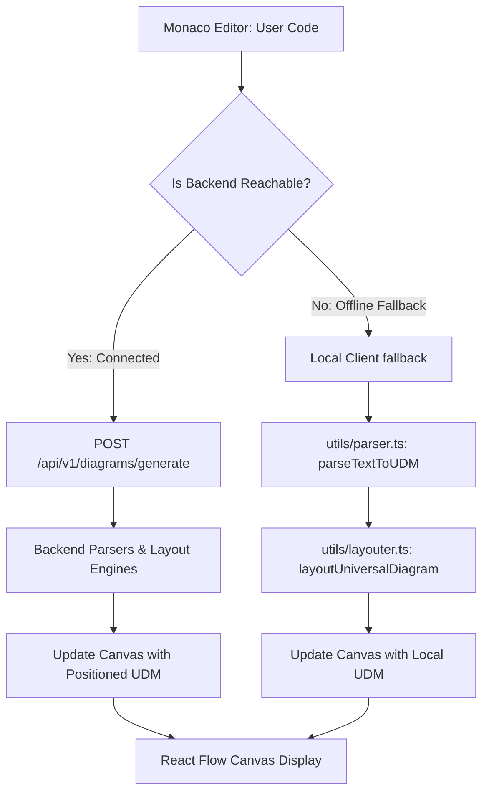

# Frontend Application Guide

This document covers the frontend single-page application built for Diagram Genie. It outlines React layout structures, state managers, and the local fallback parser logic.

---

## 1. Core Technology Stack

- **Framework**: React 19, TypeScript
- **Bundler**: Vite 8
- **Canvas Rendering**: `@xyflow/react` (React Flow 12)
- **Code Terminal**: `@monaco-editor/react`
- **State Store**: Zustand 5
- **Styling**: Vanilla CSS and TailwindCSS 4
- **Animation**: Framer Motion 12

---

## 2. Directory Structure

```text
frontend/src/
├── assets/          # Static layout resources (images, SVGs)
├── components/      # UI components
│   ├── diagram/     # Diagram canvas components, preview modules, export modals
│   ├── landing/     # Interactive dashboard widgets and showcase landing pages
│   └── layout/      # Sidebar, headers, and dashboard frames
├── config/          # Client API setup constants
├── pages/           # Page routes (Landing, EditorPage, ToolPage, Profile, Settings)
├── services/        # Backend communication endpoints
├── store/           # Zustand state configurations (authStore, diagramStore)
└── utils/           # Helper libraries, local fallbacks, and image exporters
```

---

## 3. Zustand State Management

The frontend keeps track of layout states using [`diagramStore.ts`](file:///C:/Users/jhata/.gemini/antigravity/scratch/Diagram_Genie/frontend/src/store/diagramStore.ts):

- **Theme Configuration**: Enforces a global `'dark'` mode class list update on startup.
- **Canvas States**: Holds arrays of `nodes` and `edges` actively rendered on the canvas.
- **History Undo/Redo**: Implements `past` and `future` state queues, capped at 30 entries, capturing states before user adjustments.
- **Diagnostics Cache**: Caches warning counts, parse timers, and latency logs in a `lastDiagnostics` object.
- **Saved Diagrams List**: Mock database of active user layouts (`INITIAL_SAVED_DIAGRAMS`).

---

## 4. Backend Connection vs. Local Fallback

To support offline workflows, Diagram Genie implements a **pluggable local fallback architecture**:



### Backend Available Path
1. The code terminal sends a POST request to `/api/v1/diagrams/generate`.
2. The backend resolves the sourceType, parses the syntax, enhances layout details using AI (if configured), and executes NestJS layouters.
3. The backend returns a fully positioned node layout which the frontend renders.

### Backend Unavailable (Offline Fallback Path)
1. If the API check fails, the frontend changes `backendStatus` in the `diagramStore` to `'offline'` and triggers the fallback.
2. **Local Parser**: Calls `parseTextToUDM` inside [`utils/parser.ts`](file:///C:/Users/jhata/.gemini/antigravity/scratch/Diagram_Genie/frontend/src/utils/parser.ts). This contains JavaScript implementations for parsing SQL, Prisma schemas, UML Sequence flows, Mindmaps, and cloud outline trees.
3. **Local Layouter**: Calls `layoutUniversalDiagram` inside [`utils/layouter.ts`](file:///C:/Users/jhata/.gemini/antigravity/scratch/Diagram_Genie/frontend/src/utils/layouter.ts). This contains client-side positioning code, including custom sequence diagram layout coordinates, nested box bounds configurations for cloud subnets, and layered semantic rows (external, gateway, DB) for general architecture diagrams.
4. The client positions nodes directly on the canvas without calling the backend.

---

## Related Documentation
- [REST API Endpoints Reference](api.md) — Endpoint specifications.
- [Layout Engine Guides](layout-engine.md) — Coordinates logic.
- [Exporter Guides](export.md) — Image generation flow.
