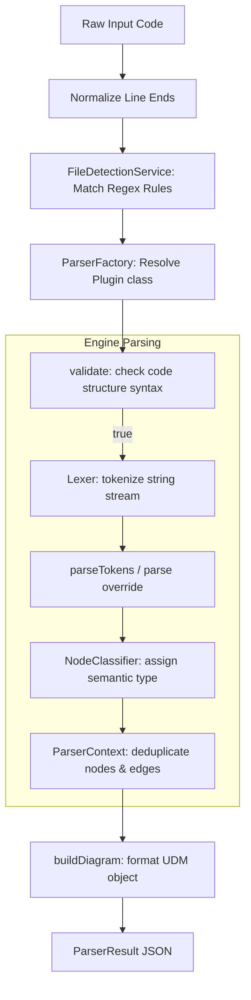

# Deterministic Parsers

Diagram Genie converts text source code into visual layouts via a pluggable, deterministic parsing system. This document outlines the parsing architecture, syntax validation rules, and schema mapping details.

---

## 1. Parsing Pipeline Flow

The parsing pipeline translates unstructured code snippets into structured graph models:



---

## 2. Core Parser Architecture

The parser system relies on a modular pattern:

### The Abstract Parser
[`AbstractParser`](file:///C:/Users/jhata/.gemini/antigravity/scratch/Diagram_Genie/backend/src/core/diagram-engine/parsers/abstract.parser.ts) is the base class for all parser plugins. It implements the `IParser` contract and provides:
- **Input Normalization**: Translates `\r\n` line breaks to `\n`.
- **Tokenization**: Leverages the [`Lexer`](file:///C:/Users/jhata/.gemini/antigravity/scratch/Diagram_Genie/backend/src/core/diagram-engine/parsers/lexer.ts) to produce syntactic token streams.
- **Node & Edge Deduplication**: Prevents duplicate nodes (matching case-insensitively) and maps connections cleanly via helper hooks `createNode` and `createEdge`.
- **Classification**: Instantiates a global `NodeClassifier` to identify nodes by name keywords (e.g., labeling anything containing "Postgres" or "DB" as type `database`).

### Parser Registry
[`ParserRegistry`](file:///C:/Users/jhata/.gemini/antigravity/scratch/Diagram_Genie/backend/src/core/diagram-engine/registry/parser.registry.ts) stores all available parsers. Plugins register themselves dynamically inside their constructors:
```typescript
constructor(private readonly registry: ParserRegistry) {
  this.registry.register(this);
}
```
The registry scans supports-checks to return the best parser:
```typescript
getParser(sourceType: string): IParser | undefined {
  return Array.from(this.parsersMap.values()).find((parser) =>
    parser.supports(sourceType)
  );
}
```

---

## 3. The ParserResult Contract

Every parser must return a [`ParserResult`](file:///C:/Users/jhata/.gemini/antigravity/scratch/Diagram_Genie/backend/src/core/diagram-engine/parsers/parser-result.interface.ts) structure containing three keys:

```typescript
export interface ParserResult {
  diagram: Diagram; // Normalized Universal Diagram Model
  warnings: string[]; // List of syntax warning warnings
  statistics: {
    linesParsed: number;
    nodesCreated: number;
    edgesCreated: number;
    ignoredLines: number;
    parseDurationMs: number;
  };
}
```

---

## 4. Entity Relationship (ER) Parsing Details

The [`SqlParser`](file:///C:/Users/jhata/.gemini/antigravity/scratch/Diagram_Genie/backend/src/core/diagram-engine/parsers/sql.parser.ts) converts SQL DDL schemas into ER model representations.

### Canonical Columns Schema
To guarantee layout and rendering consistency, table fields are stored in the UDM node object `data.columns` as a normalized array of `ColumnInfo` objects:

```typescript
export interface ColumnInfo {
  name: string;      // Column identifier name
  type: string;      // SQL datatype (e.g. VARCHAR(255))
  primaryKey: boolean;  // True if defined as Primary Key
  foreignKey: boolean;  // True if referenced in a foreign key relation
  nullable: boolean;    // True unless NOT NULL is specified
}
```

### Supported Foreign Key Declarations
The SQL parser evaluates relationships in three distinct ways:
1. **Inline Column References**:
   ```sql
   CREATE TABLE orders (
     id INT PRIMARY KEY,
     user_id INT REFERENCES users(id)
   );
   ```
2. **Standalone Table Constraints**:
   ```sql
   CREATE TABLE orders (
     id INT PRIMARY KEY,
     user_id INT,
     FOREIGN KEY (user_id) REFERENCES users(id)
   );
   ```
3. **Out-of-Line ALTER TABLE Constraints**:
   ```sql
   ALTER TABLE orders ADD CONSTRAINT fk_user FOREIGN KEY (user_id) REFERENCES users(id);
   ```

---

## 5. Parser Limitations

- **Syntax Sensitivity**: Parsers are designed to extract layouts from valid code fragments. Syntax errors or nested configurations can result in ignored lines or empty diagrams.
- **Language Dialects**: The SQL parser parses standard CREATE TABLE schemas, but complex procedural queries or vendor-specific partitions (e.g., PL/SQL blocks) will be skipped.
- **Dynamic Imports**: When parsing OpenAPI specifications, the parser works only with flat JSON specifications; externally referenced sub-schema files (`$ref: "other.json"`) cannot be loaded dynamically.

---

## Related Documentation
- [Universal Diagram Model Specification](udm.md) — Node and edge attributes mapping.
- [Layout Engine Guides](layout-engine.md) — Positional algorithms registration.
- [Renderer System](rendering.md) — React Flow mapping rules.
