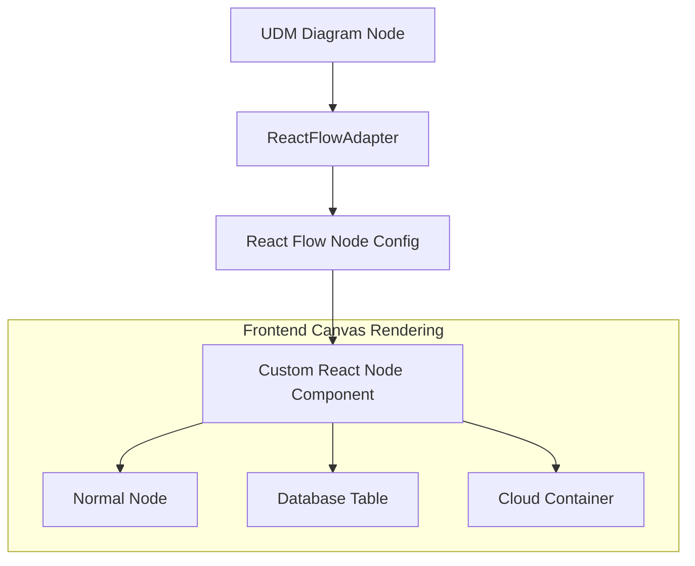

# Renderer Adapters & Shapes

This document details how the Universal Diagram Model (UDM) is mapped to visual React Flow nodes, edge connectors, custom SVG shapes, and relationship indicators.

---

## 1. Canvas Rendering Architecture

Diagram Genie leverages [`@xyflow/react`](https://reactflow.dev/) (React Flow 12) to draw interactive canvas layouts on the frontend. The translation from the abstract UDM to React Flow JSON is handled by the `ReactFlowAdapter` on the backend, or the local fallback parser on the frontend.

---

## 2. Custom Node Types

The application registers several custom React Flow nodes in [`frontend/src/components/diagram/CustomNodes.tsx`](file:///C:/Users/jhata/.gemini/antigravity/scratch/Diagram_Genie/frontend/src/components/diagram/CustomNodes.tsx):

- **`database-table` (Database Table)**: Displays columns in a structured table. Primary Keys are highlighted with a gold key icon, while Foreign Keys display connection links.
- **`cloud-container` (Cloud Containment)**: Outer group nodes representing virtual networks or subnets. They utilize semi-transparent background styles and dotted borders.
- **`uml-class` (UML Class)**: Divided class rectangles displaying class names at the top, attributes in the middle, and methods at the bottom.
- **`decision` (Flowchart Decision)**: Rotated diamond shapes mapping logical branch points.
- **`process` (Flowchart Process)**: Standard process step rectangles.
- **`actor` / `server` / `gateway` / `queue`**: Services mapped to dedicated layouts (e.g., actor icon for clients, network gateway block for routers).

---

## 3. Relationship Markers & Edge Styles

To support standard UML and entity relations, the application configures custom SVG marker definitions at the edge ends:

### Custom SVG Markers
The edge markers are defined in `CustomNodes.tsx` and mapped in [`frontend/src/utils/layouter.ts`](file:///C:/Users/jhata/.gemini/antigravity/scratch/Diagram_Genie/frontend/src/utils/layouter.ts):
- **`uml-inheritance`**: Renders a hollow triangle pointing to the super-class node.
- **`uml-aggregation`**: Renders a hollow diamond pointing to the aggregate node.
- **`uml-composition`**: Renders a filled diamond pointing to the composite node.
- **`arrowclosed`**: Standard closed arrow pointing in the direction of the relation.

### Relationship Mappings

| Relation Type | Edge Style | Marker Type | Animation | Usage |
| :--- | :--- | :--- | :--- | :--- |
| **Inheritance** | Solid Straight | `uml-inheritance` | False | UML Class subclasses |
| **Aggregation** | Solid Straight | `uml-aggregation` | False | Weak reference dependencies |
| **Composition** | Solid Straight | `uml-composition` | False | Strong reference containment |
| **Dependency** | Dashed | `arrowclosed` | True | Dynamic service dependencies |
| **Association** | Solid Straight | `arrowclosed` | False | Generic structural links |
| **Data Flow** | Smoothstep | `arrowclosed` | True (Animated) | Default architecture paths |

---

## 4. Canvas vs Export Rendering

It is important to understand the execution difference between interactive editor rendering and static image exports:

### Interactive Editor Canvas
- Renders custom HTML/React elements inside DOM containers.
- Users can zoom, pan, drag nodes, and update label text dynamically using inline inputs.
- Stateful animations (e.g. glowing pulses traversing dashed edge paths) are processed live.

### Static Image Exports
- Visual image generation is handled via frontend libraries like `html-to-image` ([`frontend/src/utils/export/ExportRenderer.ts`](file:///C:/Users/jhata/.gemini/antigravity/scratch/Diagram_Genie/frontend/src/utils/export/ExportRenderer.ts)).
- The renderer serializes the SVG DOM nodes, converts them to canvas buffers, and generates downloadable SVG or PNG binaries.

> [!WARNING]
> **Export Verification Status**: While export handlers exist, comprehensive visual verification has not been performed across all 11 diagram types. Visual layout parity (such as complex nested containment borders rendering identically in exports) is not guaranteed.

---

## Related Documentation
- [Universal Diagram Model Specification](udm.md) — Node data parameters.
- [Layout Engine Guides](layout-engine.md) — Node coordinate calculations.
- [Export System Overview](export.md) — Serializer limits and image bounds.
